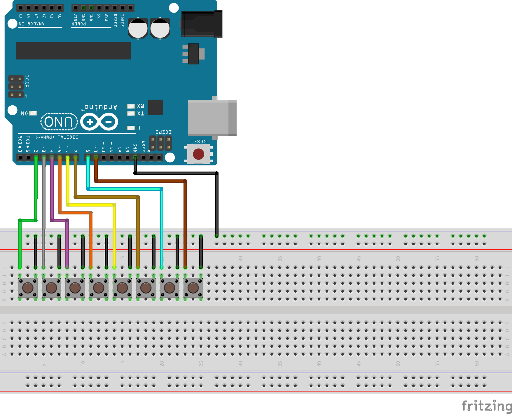
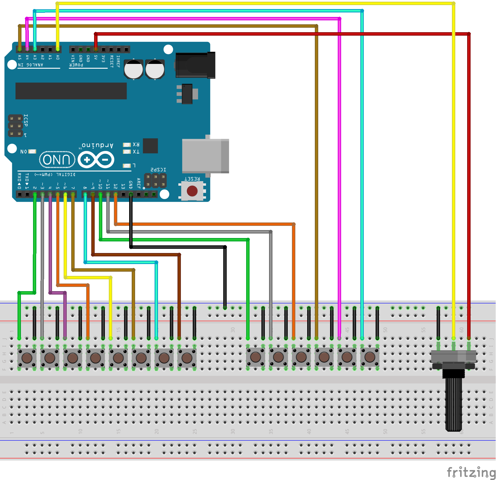
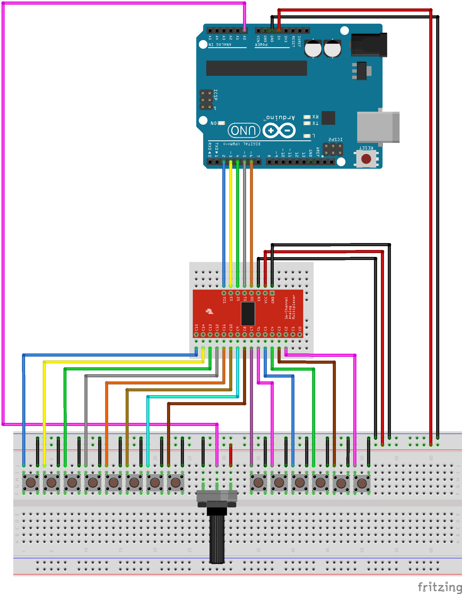
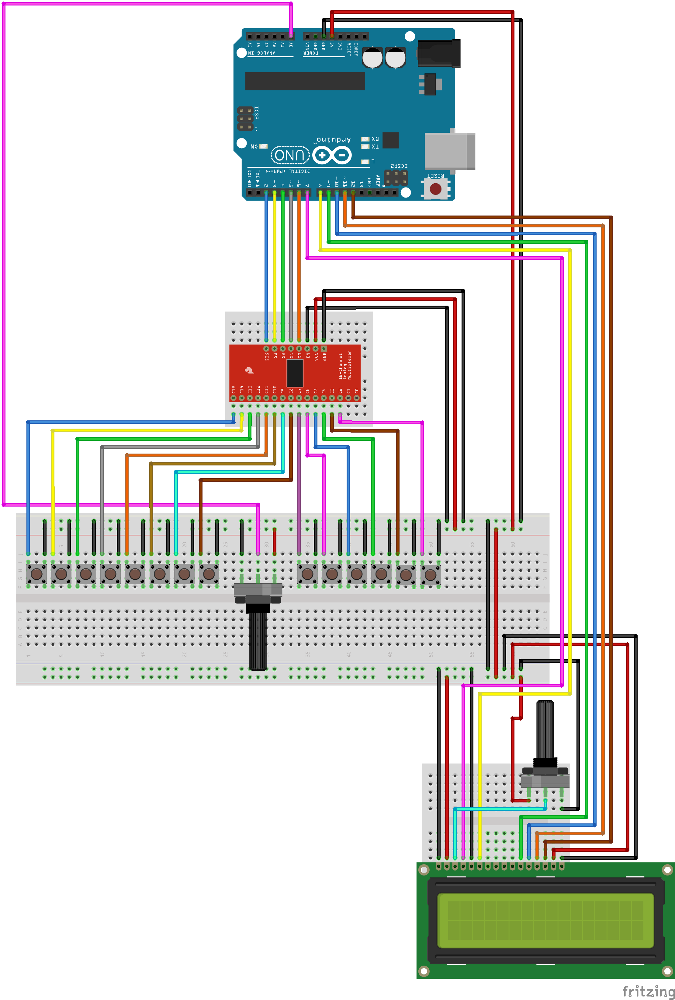
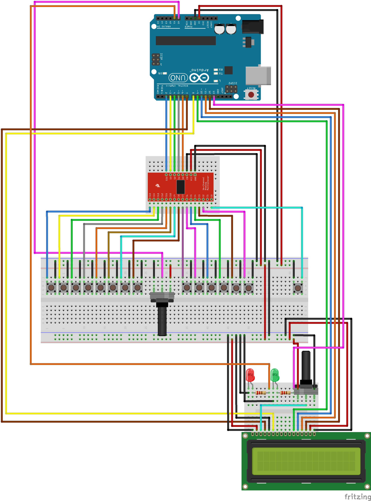

<div align="center">
    
</div>

# Arpeggino

An Arduino MIDI arpeggiator, sequencer, recorder and looper.

*Arpeggino* lets you play MIDI arpeggios in every scale and pattern,
record and loop your sequences,
and modify your sequences even after recording and be creative.

## Table of Contents

* [What Is Arpeggino?](#what-is-arpeggino)
* [Demo](#demo)
* [Project Code](#project-code)
* [Project Setup](#project-setup)
* [Tutorial](#tutorial)
    * [Step Zero - Prerequisites](#tutorial-step-zero---prerequisites)
    * [Step One - Playing Arpeggios](#tutorial-step-one---playing-arpeggios)
    * [Step Two - Configuring the Arpeggios](#tutorial-step-two---configuring-the-arpeggios)
    * [Step Three - LCD](#tutorial-step-three---lcd)
    * [Step Four - Recording](#tutorial-step-four---recording)
    * [Step Five - Layers](#tutorial-step-five---layers)

## What Is Arpeggino?

*Arpeggino* is an Arduino based MIDI arpeggiator, sequencer, recorder and looper.
It supports playing MIDI arpeggios in every scale and pattern, and in many rhythms.

When pressing one of the keys, an arpeggio of the respective scale degree will be playing.
If not in recording mode, the arpeggio will stop playing once the key is released.

Every aspect of the arpeggios can be configured, and the configuration is shown on the LCD screen:
* Root note of the scale (e.g. C, D#, E, Fb)
* Scale mode: Ionian, Dorian, Phrygian, Lydian, Mixolydian, Aeolian, Locrian
* Octave (e.g. 2, 3, 4)
* Permutation (i.e. the order in which the arpeggio notes are being played)
* Number of Steps (i.e. the number of notes of the arpeggio)
* Rhythm (i.e. the musical rhythm in which the arpeggio is being played)
* BPM

*Arpeggino* also lets you to record your sequences, for any number of bars you want.
You can delete recorded layers, record new ones on top of the sequence, and even reconfigure recorded layers.
This lets you focus on your musical creativity and experiment with different scales, styles, and rhythms.

## Demo

A short demo video is available on [YouTube](https://youtu.be/HbMf0oO-zfE).

## Project Code

Arpeggino consists of three sub-projects:

- [Controlino](https://github.com/levosos/Controlino) -
An Arduino library for using complex gestures of input controls behind a multiplexer.
It is the library used in Arpeggino to easily control buttons and potentiometers behind a multiplexer.
It allows the detection of complex click gestures such as click/double-click/long click (press)/etc.
- [Midier](https://github.com/levosos/Midier) -
An Arduino library for playing, recording, looping and programming MIDI notes, arpeggios and sequences.
This is the engine behind Arpggino, that lets it do all the musical and rhythmical stuff.
- *Arpeggino* (this very repository) -
The Arduino sketch project.
This project is responsible for handling all I/O controls (keys, buttons, potentiometers, LCD), configuring Midier and using it for recording and playing the sequences.

Both [Controlino](https://github.com/levosos/Controlino) and [Midier](https://github.com/levosos/Midier) are comprehensively documented and feature plenty of [examples](https://github.com/levosos/Midier#listen-to-examples) you can check out and listen to right from your browser.

Both libraries are officially published and can be installed directly from the Arduino IDE Library Manager ([here's](https://www.arduino.cc/en/guide/libraries) a short guide).

## Project Setup

*Arpeggino* sends MIDI commands over the Arduino serial connection.
These MIDI commands can be the input to any device that supports MIDI as input.
A computer software can accept MIDI commands as well.
Therefore, the computer can be the device we connect the Arduino to.

There are two main ways you can connect Arpeggino to your computer:
1. Over the USB connection using the help of some software (I use [Hairless MIDI-Serial Bridge](https://projectgus.github.io/hairless-midiserial/))
2. Using a MIDI-to-USB cable

The two ways are fully documented [here](https://github.com/levosos/Midier#setup) in Midier GitHub repository.

Note that you need to set the baud rate properly in the Arduino sketch (the parameter passed to the `Serial.begin()`) according to the way you are connecting your Arduino to the MIDI device. This is also fully described [here](https://github.com/levosos/Midier#baud-rate) in Midier GitHub repository.

# Tutorial

This is a tutorial on how to build Arpeggino by yourself.
It was published on [Arduino Project Hub](https://create.arduino.cc/projecthub/razrotenberg/arpeggino-midi-arpeggiator-sequencer-recorder-and-looper-5aeb7b) as well.

**This tutorial is 100% plug and play**. Code (sketches), schemas, and illustrations of all steps are in the subdirectories under [tutorial](tutorial).

You can even stop reading the tutorial right here if you want, and just do it on your own by following the schema of each step and uploading its sketch as-is.

We will be covering the main additions of every step and will have a look at code samples for some explanation.

## Tutorial: Step Zero - Prerequisites

Clone this repository to have all source files on your computer.

Install Midier and Controlino using the Arduino Library Manager ([here's](https://www.arduino.cc/en/guide/libraries) a short guide)

Pick your MIDI-to-Serial bridge software. I personally use [Hairless MIDI-Serial Bridge](https://projectgus.github.io/hairless-midiserial/) for this. Make sure you choose the same baud rate as you will be using in the Arduino sketch (I use 9600)

Pick your favorite software for playing MIDI notes. A few that I know of: GarageBand (my choice), Logic Pro X, Ableton, Cubase, LMMS, etc.

Optionallly, check out some of [Midier examples](https://github.com/levosos/Midier#listen-to-examples) on GitHub and verify your setup works

## Tutorial: Step One - Playing Arpeggios

Here's a video on [YouTube](https://youtu.be/3n4ExSrUI3Q) demonstrating what we will achieve in this step of the tutorial.

First we need to connect a few buttons to the Arduino. Having eight buttons is optimal as it is the number of notes in diatonic scales (including one for the root at an octave higher).

To simplify the development, it's better to connect all buttons to sequential pins on the Arduino (e.g. pins 2-9).

We use `INPUT_PULLUP` for buttons ([here's](https://www.arduino.cc/en/Tutorial/InputPullupSerial) an explanation) one leg of the button should be plugged to GND and the other leg to the Arduino.

Here's a [schema](tutorial/1__playing_arpeggios/1__playing_arpeggios.fzz) you can use:
<div align="center">
    
</div>

Now the setup is ready, and we can start coding.

You can use the [existing Arduino sketch](tutorial/1__playing_arpeggios/1__playing_arpeggios.ino), or you can code it yourself to see how easy it is.
For the sake of the tutorial, I'll assume you'll be coding yourself.

Open up a new Arduino sketch and add the following imports:
```
#include <Controlino.h>
#include <Midier.h>
```

We now need to create a Midier sequencer to play arpeggios, as Midier is the engine behind Arpeggino. A sequencer should be initialized with some layers (which dictate the maximum number of concurrent layers that could be played) upon creation.

The sequencer should be declared in a global scope for its state to be preserved all the time, and should not be declared inside a method.
```
midier::Layers<8> layers;
midier::Sequencer sequencer(layers);
```

We also need to initialize the Arduino Serial module with the correct baud rate (the one you are using in the software as well). I'm using 9600.
```
void setup()
{
    Serial.begin(9600);
}
```

Now comes the real action. Every iteration, we want to check if any of the keys was pressed or released, and start or stop playing the arpeggio respectively. After checking for I/O, we have to "click" Midier.

The following code might seem complicated at first sight but it is really not.
We define a structure that extends Controlino's `Key` that can hold the handler of an arpeggio that is being played by Midier.
We use this structure and initialize an array of keys using with the pin numbers to which the buttons are connected (here the buttons are connected to pins 2-9).
We then check if the key was pressed (`Down` event) or released (`Up` event) and start or stop the arpeggio of the respective scale degree.
Eventually we "click" the Midier sequencer for it to play and stop the MIDI notes.

```
void loop()
{
    // we extend `controlino::Key` so we could hold a Midier handle with every key
    struct Key : controlino::Key
    {
        Key(char pin) : controlino::Key(pin)
        {}

        midier::Sequencer::Handle h;
    };

    static Key __keys[] = { 2, 3, 4, 5, 6, 7, 8, 9 }; // initialize with pin numbers


    for (auto i = 0; i < sizeof(__keys) / sizeof(Key); ++i)
    {
        auto & key = __keys[i];

        const auto event = key.check();

        if (event == Key::Event::None)
        {
            continue; // nothing has changed
        }

        if (event == Key::Event::Down) // a key was pressed
        {
            key.h = sequencer.start(i + 1); // start playing an arpeggio of the respective scale degree
        }
        else if (event == Key::Event::Up) // a key was released
        {
            sequencer.stop(key.h); // stop playing the arpeggio
        }
    }

    // actually click Midier for it to play the MIDI notes
    sequencer.click(midier::Sequencer::Run::Async);
}
```

And that's it! Upload it onto your Arduino, start the MIDI-to-Serial bridge software, open up your DAW (or any software that plays MIDI notes) and press the keys!
You should hear arpeggios from the C major scale as you press the keys.

## Tutorial: Step Two - Configuring the Arpeggios

Now that we have successfully played some arpeggios, it's time for us to start configuring them.

Here's a video on [YouTube](https://youtu.be/RrJOeYbTeBo) demonstrating what we will achieve in this step of the tutorial.

As listed [here](#what-is-arpeggino), every aspect of the arpeggio can be configured and changed.
Therefore, we are going to have an I/O control for every configuration parameter.

We will use a potentiometer for controlling the BPM and six buttons for controlling all other configuration parameters.

Here's a [schema](tutorial/2__configuration/2__configuration.fzz) you can use:

<div align="center">
    
</div>

Now let's do some coding again.
We will extend our Arduino sketch from the previous step, but in this step of the tutorial I'll not go through all the code that needs to be written but just some of it that covers the main concepts.
Please refer to the [Arduino sketch](tutorial/2__configuration/2__configuration.ino) for the full implementation or just use it as-is.

First of all, we will have to create an object for every I/O control we are using.
We will have a `controlino::Potentiometer` for the BPM I/O control and limit its value to be at least 20 and at most 230.
We will have a `controlino::Key` for all other I/O controls.

Here is the I/O control object declarations, using the pin numbers as shown in the schema:
```
namespace io
{

controlino::Potentiometer BPM(A0, /* min = */ 20, /* max = */ 230); // we limit the value of BPM to [20,230]
controlino::Key Note(10);
controlino::Key Mode(11);
controlino::Key Octave(12);
controlino::Key Perm(A5);
controlino::Key Steps(A4);
controlino::Key Rhythm(A3);

} // io
```

If you have connected fewer I/O controls, make sure to comment out all the code that uses this I/O control.
A good way is to comment out the I/O control object declaration and comment out all code that fails to compile.

After creating the I/O objects, we are going to use them.
Every time `loop()` gets called, we want to check for any I/O activity, and change the configuration parameter of the respective I/O control.

We will declare a `Configurer` for every I/O control.
A `Configurer` will be a method that is responsible for updating a single configuration parameter according to changes of an I/O control.
We will use the `check()` method of our `controlino` I/O controls to check for I/O events.

Let's take a look at the `BPM` configurer:

```
namespace configurer
{

void BPM()
{
    // if the value of the potentiometer has changed (since the last time `loop()`
    // was called), we read the new value of the potentiometer (limited within the
    // range [20,230]) and set it as the current BPM of the sequencer

    if (io::BPM.check() == controlino::Potentiometer::Event::Changed)
    {
        sequencer.bpm = io::BPM.read();
    }
}

} // configurer
```

Let's take a look at the `Octave` configurer:
```
namespace configurer
{

void Octave()
{
    // if the key was pressed, we increase the octave by one, while
    // limiting it to the range [1,7] and set it as the new configuration value

    if (io::Octave.check() == controlino::Key::Event::Down)
    {
        const auto current = sequencer.config.octave();
        const auto next = (current % 7) + 1;

        sequencer.config.octave(next);
    }
}

} // configurer
```

We will have such `Configurer` methods for every I/O control.
Take a look at them in the [Arduino sketch](tutorial/2__configuration/2__configuration.ino) of this step.

We will now have an array to hold all the `Configurer` methods so we could iterate through all of them easily:

```
namespace configurer
{

// a configurer is a method that is responsible for updating a single
// configuration parameter according to changes of an I/O control
using Configurer = void(*)();

Configurer All[] =
    {
        BPM,
        Octave,

        // all other configurer methods
    };

} // configurer
```

Now we have to call each and every `Configurer` method every time `loop()` gets called.
We will declare a helper method to do so:

```
namespace handle
{

void configurers()
{
    // configurers will update the configuration on I/O events

    for (const auto & configurer : configurer::All)
    {
        configurer();
    }
}

} // handle
```

And call it in `loop()`, by adding the following line:

```
void loop()
{
    handle::configurers();

    // everything else..
}
```

That's it!
We declared objects for our I/O controls, implemented `Configurer` methods to update the configuration when an I/O event was received on each I/O control, and called all `Configurer` methods every time `loop()` gets called.

Go ahead and play some arpeggios. This time, play around with the new buttons and the potentiometer we have just added, and listen how they affect the arpeggios that you are playing.

## Tutorial: Step Three - LCD

In this step we will add an LCD to our setup for presenting the configuration.

Here's a video on [YouTube](https://youtu.be/JMmgKkIBqL4) demonstrating what we will achieve in this step of the tutorial.

Connecting an LCD to the Arduino requires 6 (digital) I/O pins.
I'm using and Arduino UNO and in the current setup, with all keys and configuration buttons, there are no six more available I/O pins.
Therefore, I'm using a 16-channel multiplexer ([here's](https://www.instructables.com/id/Tutorial-74HC4067-16-Channel-Analog-Multiplexer-De/) a great guide) in order to significantly reduce the number of I/O pins that will be used for all the keys and configuration buttons.
This will make plenty more I/O pins available on the Arduino, allowing to connect an LCD to it.

I'm also using two more mini breadboards to help me organize the main breadboard.
There are a lot of possibilities here.
You can use a single breadboard. I did it at first, it's possible but might be suboptimal.
You can use an extra mini breadboard or two.
You can use an extra full breadboard.
So just use whatever gear you have and choose your preferred setup layout.
I use more than a single breadboard because connecting a lot of buttons, potentiometers, and an LCD results in a pretty cluttered breadboard.
Alternative schemas are available [here](tutorial/3__lcd/3_2__basic_lcd).

Don't worry if you don't have all this hardware.
All the new components we will be adding are probably not available to everyone.

First of all, I'd recommend you to order those parts so you could eventually build your full Arpeggino.
In the meantime, you can skip this step of the tutorial entirely and continue to the next steps without an LCD for now.

If you have an LCD but you don't have a multiplexer, you can get rid of some of the keys to free up some pins for the LCD.

If you now have all the needed hardware components (an LCD and a multiplexer), we can continue with this step of the tutorial.

Adding the LCD to our project requires many changes, both in hardware and software.
To ease the tutorial, and decrease the amount of changes needed to be done before seeing some feedback, this step is split to three sub-steps.
You can follow them one by one to get some feedback from the Arduino that you are headed in the right direction.
You can also just go ahead and follow the last one (part 3) if you are feeling in control.

### Part 1 - Multiplexer

First, we will add the 16-channel multiplexer to our setup.
The multiplexer itself takes some space on the breadboard, so I'm using an extra mini breadboard for it to have a place for itself.
Again, this is not mandatory and just go on with the hardware you have ([here's](tutorial/3__lcd/3_2__basic_lcd/3_2__basic_lcd__alt_2.png) a schema I used when I did not have an extra mini breadboard).

In addition, we will reorganize the buttons and the potentiometer a bit.
This is for the laying the groundwork for the next steps.

Here's the [schema](tutorial/3__lcd/3_1__multiplexer/3_1__multiplexer.fzz) of my setup:

<div align="center">
    
</div>

Now to the software side.

We will create a `controlino::Multiplexer` object for the usage of the multiplexer.
Upon creation, we will pass a `controlino::Selector` object to it as an argument that encapsulates the selection pins of a multiplexer.

```
namespace io
{

controlino::Selector Selector(/* s0 = */ 6, /* s1 = */ 5, /* s2 = */ 4, /* s3 = */ 3);
controlino::Multiplexer Multiplexer(/* sig = */ 2, Selector);

} // io
```

Now, all configuration buttons are behind the multiplexer.
We will pass `io::Multiplexer` to the creation of each `controlino::Key`, and use the channel number as the pin number.

```
namespace io
{

controlino::Key Note(Multiplexer, 7);
controlino::Key Mode(Multiplexer, 6);
controlino::Key Octave(Multiplexer, 5);
controlino::Key Perm(Multiplexer, 4);
controlino::Key Steps(Multiplexer, 3);
controlino::Key Rhythm(Multiplexer, 2);

} // io
```

In addition, all keys were moved to behind the multiplexer as well.
Therefore, we will pass `io::Multiplexer` upon their creation as well, and will use the channel numbers as pin numbers.

```
namespace handle
{

void keys()
{
    struct Key : controlino::Key
    {
        Key(char pin) : controlino::Key(io::Multiplexer, pin) // keys are behind the multiplexer
        {}

        // ...
    };

    static Key __keys[] = { 15, 14, 13, 12, 11, 10, 9, 8 }; // channel numbers of the multiplexer

    // ...
}

} // handle
```

Go ahead and upload the sketch onto your Arduino to see that everything is still working.

### Part 2 - Basic LCD

Now it's time for the real thing.
We freed up some I/O pins in the Arduino, and we can now add the LCD to our setup.

I'm using a second extra mini breadboard for this, but again, this is not mandatory ([here's](tutorial/3__lcd/3_2__basic_lcd/3_2__basic_lcd__alt_1.png) a schema I used when I did not have a second extra mini breadboard).

Here's the [schema](tutorial/3__lcd/3_2__basic_lcd/3_2__basic_lcd.fzz) of my setup:

<div align="center">
    
</div>

And again to coding.
We are using [LiquidCrystal](https://www.arduino.cc/en/Reference/LiquidCrystal) library to control the LCD.
We will be extending the `LiquidCrystal` to fit better to our needs (have a look at `io::LCD` to see the implementation) and will create `io::lcd` using the pins shown in the schema.

Our LCD layout consists of a component for every configuration parameter.
Every component will be printed in a specific position in the LCD, and is responsible for printing its configuration parameter.
Some of the components have a prefix or suffix as well.
We call this prefix or suffix the title, and the configuration parameter value is the data.
We want to print the titles once at the beginning, and to reprint the data every time the configuration parameter changes.

We will have a `viewer::Viewer` method that will be responsible for printing both the title and data of a single configuration parameter.
This is just like we have a `configurer::Configurer` which is responsible for updating the configuration parameter according to changes of an I/O control.

Let's take a look at `viewer::BPM` for example:

```
namespace viewer
{

void BPM(What what)
{
    if (what == What::Title)
    {
        io::lcd.print(13, 1, "bpm");
    }

    if (what == What::Data)
    {
        io::lcd.print(9, 1, 3, state::sequencer.bpm);
    }
}

} // viewer
```

We will replace our array of `Configurer`s with a new structure to which we call `Component` that holds both a `Configurer` and a `Viewer`.

```
namespace component
{

struct Component
{
    configurer::Configurer configurer;
    viewer::Viewer viewer;
};

Component All[] =
    {
        { configurer::BPM, viewer::BPM },
        { configurer::Note, viewer::Note },
        { configurer::Mode, viewer::Mode },
        { configurer::Octave, viewer::Octave },
        { configurer::Perm, viewer::Style },
        { configurer::Steps, viewer::Style },
        { configurer::Rhythm, viewer::Rhythm },
    };

} // component
```

To support reprinting the configuration parameter data when changes, we will have all configurers returning a boolean value that will indicate whether the parameter has changed.
If so, we will call its viewer to reprint the data.

```
namespace handle
{

void configurers()
{
    for (const auto & component : component::All)
    {
        if (component.configurer())
        {
            component.viewer(viewer::What::Data); // reprint the value on the LCD if changed
        }
    }
}

} // handle
```

The last thing we have to do is to initialize our LCD at startup and print all titles and initial configuration values. This is done in `setup()`

```
void setup()
{
    // ...

    io::lcd.begin(16, 2);

    for (const auto & component : component::All)
    {
        component.viewer(viewer::What::Title);
        component.viewer(viewer::What::Data);
    }
}
```

### Part 3 - Advanced LCD

After spending some time with the current setup, you might feel like we are not utilizing the LCD properly.
Meaning, it's only full of short summarization of the configuration parameters, but in a not really informative way.
For example, the rhythm and style are presented as numbers that could tell us pretty much nothing, the scale mode is not in its full name, and more.

This step will improve what the LCD has to offer in Arpeggino.
This step requires no hardware changes from the [previous part](#part-2---basic-lcd), so just follow its schema if you skipped it.
In case you implemented the previous step, there's nothing more for you to do now with the hardware.

We are introducing a new "focus" mode for `Viewer`s to use the entire LCD for printing a longer description of the parameter while being configured.
This is not used by all `Viewer`s.

In addition, the previous summary view is kept and is the one being used when not currently configuring parameters.
To support this, we also introduce a helper class `utils::Timer` to allow us to easily check for how much time elapsed and if we should go back to summary view.

We will not have a look at some specific code samples but I encourage you to go ahead and explore the code by yourself.

## Tutorial: Step Four - Recording

One of the major features of Arpeggino is the ability to record and playback MIDI sequences.
In this step we will add the support for that.

Here's a video on [YouTube](https://youtu.be/THWG4ku-cRw) demonstrating what we will achieve in this step of the tutorial.

The only hardware addition that is really needed is a single button.
We will add two more LEDs, a green one and a red one, to improve the user experience.
The red one will indicate whether Arpeggino is recording, and the green one will blink when entering a new bar in the sequence.

If you skipped the previous step and did not add a multiplexer and an LCD to your setup, or diverged a bit from the schemas we are using, just add a single button to your setup and you are good to go.

Here's the [schema](tutorial/4__recording/4__recording.fzz) of my setup:

<div align="center">
    
</div>

We will declare our I/O object, and now we will use `controlino::Button` as we will use a few more click gestures, such as long-press and a click-and-press.

```
namespace io
{

controlino::Button Record(Multiplexer, 0);

} // io
```

We will add a control method that will handle I/O events from this button.
Upon each event we will call a method of our Midier sequencer.
On click, we will toggle the recording mode using `record()`.
This is fully documented [here](https://github.com/levosos/Midier#recording-and-looping) on Midier repository.
On long click (press), we will revoke the last recorded layer.
On click and press, we will stop the recording entirely.

```
namespace handle
{

void record()
{
    const auto event = io::Record.check();

    if (event == controlino::Button::Event::Click)
    {
        state::sequencer.record();
    }
    else if (event == controlino::Button::Event::Press)
    {
        state::sequencer.revoke();
    }
    else if (event == controlino::Button::Event::ClickPress)
    {
        state::sequencer.wander();
    }
}

} // handle
```

We also want to print the bar index within the current loop.
We will use the return value of `sequencer.click()` for this.
It returns the bar index if just entered a new bar in a loop, `Bar::Same` if there's no change, and `Bar::None` if the loop was just stopped.
In case a bar index is returned, we will blink the green LED, and print it using a new method `control::view::bar()`.
In case the loop was stopped, `Bar::None` will be returned and we will clear this part of the screen.

```
namespace handle
{

void click()
{
    const auto bar = state::sequencer.click(midier::Sequencer::Run::Async);

    if (bar != midier::Sequencer::Bar::Same)
    {
        control::flash();

        if (viewer::focused == nullptr)
        {
            control::view::bar(bar);
        }
    }
}

} // handle
```

The [sketch](tutorial/4__recording/4__recording.ino) of this step adds some more code, but we will not cover it here as it is pretty straightforward.

## Tutorial: Step Five - Layers

In the previous step we added the support to record sequences in Arpeggino.
In this step we will add the support to iterate recorded layers and control them individually.

Here's a video on [YouTube](https://youtu.be/3yDC3sfVmBc) demonstrating what we will achieve in this step of the tutorial.

While recording, every key press creates a new layer in the sequence with the respective scale degree.
Along with its scale degree, each layer has its configuration.

By default, all layers point to the common configuration (also called the global configuration) - the one that is shown on the LCD.
This means that even after recording, you can change the common configuration, and all recorded layers will follow along your changes.
This allows us to play around different styles and rhythms even after recording a sequence.

A layer can also detach from the common configuration and have its own private configuration.
After detaching from the common configuration, any changes to the common configuration will not affect the layer.

When a layer points to the common configuration it is called "dynamic", and when it's detached from it and has its own private configuration, it is called "static".

These two possibilities together significantly expand the boundaries of our recorded sequences.
We can combine both static and dynamic layers in our sequence.
For example, we can have some static layers to play the role of a bass, configured to a certain octave, note, style, or rhythm.
At the same time, we can have some dynamic layers with the melody itself, and playing around with their configuration post recording.

In this step of the tutorial, we will add the support to iterate recorded layers, and convert dynamic layers to be static layers and vice versa.
While iterating layers, the layer number will be printed on the LCD, and its configuration - whether it's the common one or a private one - will be the one shown on the LCD.
Also, while iterating layers, we will decrease the volume of all the other layers, so we could use our ears and easily understand which layer is selected at the moment.
When a layer is selected, changing the configuration will cause the layer to detach from the common configuration, and the shown configuration will be set to its private configuration.
Any changes while a layer is selected will affect only the selected layer.

A short detour if we are already talking of layers:

Layers can be either finite or infinite.
A finite layer is a layer that starts some time within the sequence and stops at another time, before the sequence has fully looped.
An infinite layer is a layer that is played all along the sequence.

For example, if we have a sequence of 4 bars, and we pressed a certain key for 2 bars, then its layer is finite.
In contrast, if we pressed the key and did not release it until all 4 bars played entirely, and the sequence started to loop itself, then the layer is infinite.

Infinite layers will always be continuous, regardless of the number of bars in the sequence, the number of steps of the arpeggio, and the rhythm.
Finite layers are not continuous, they stop when the key was released, and start again when it was pressed in the next loop of the sequence.

Let's take an extreme example, and say that we have a sequence of a single bar.
Let's also say that we are playing in the rhythm of triplets, meaning that we have three notes in a bar.
What happens if we played an arpeggio with more than three steps? The answer is that it depends.

If the key was pressed all along the sequence, then the layer is infinite, and the entire arpeggio will be played, with the correct number of steps.
If, for example, we use six steps, then it will be played across two bars, even that our sequence is a single bar long.
This might seem odd when you think about it, but your ears and feeling would suggest that it is clearly necessary, and it's the native and expected behavior if you continuously pressed a key along your sequence.

In contrast, if we released the key sometime before the loop was fully completed, then the layer would stop and start again in the next loop, meaning that not all steps would be heard.
This is again the expected behavior if you released the key within the loop.
Play with it for some time and you'll get the feeling.

Now that we have much more information about layers, we could get back to the tutorial.

On the hardware side, a single button is needed. I added it next to the recording button.

Here's the [schema](tutorial/5__layers/5__layers.fzz) of my setup:

<div align="center">
    
</div>

Now to the software side.
Until now, we only referred to the common configuration.
We now want to point to other configurations sometimes - the selected layer's configuration.
Therefore, we will have a pointer that will point to the currently shown configuration, and we will refer to it in all places we referred to the common configuration.
It will be initialized by pointing to the common configuration.

```
namespace state
{

midier::Config * config = &sequencer.config;

} // state
```

We will also have to handle I/O events from the newly added button.
Here's a summary of the supported gestures and their actions:
- *Click* - Selects the next layer. This selects the first layer if currently no layer is selected, or the next one if one is currently selected. After the last layer, this will go back to the common configuration. We will set `state::configuration` to point to the configuration of the selected layer and print it in summary view.
- *Press* - If a layer is selected, and is statically configured, we will make it dynamic again, so it will follow the common configuration again. If no layer is selected, we will convert all dynamic layers to be statically configured.
- *ClickPress* - This will convert all layers to be dynamically configured. The common configuration will be printed in summary view.

The [sketch](tutorial/5__layers/5__layers.ino) of this step has more code additions, but we will not cover anymore.
They contain the printing of the layer number in summary view, the handling of timers (going back to the common configuration after a few seconds), and some more minor changes.
